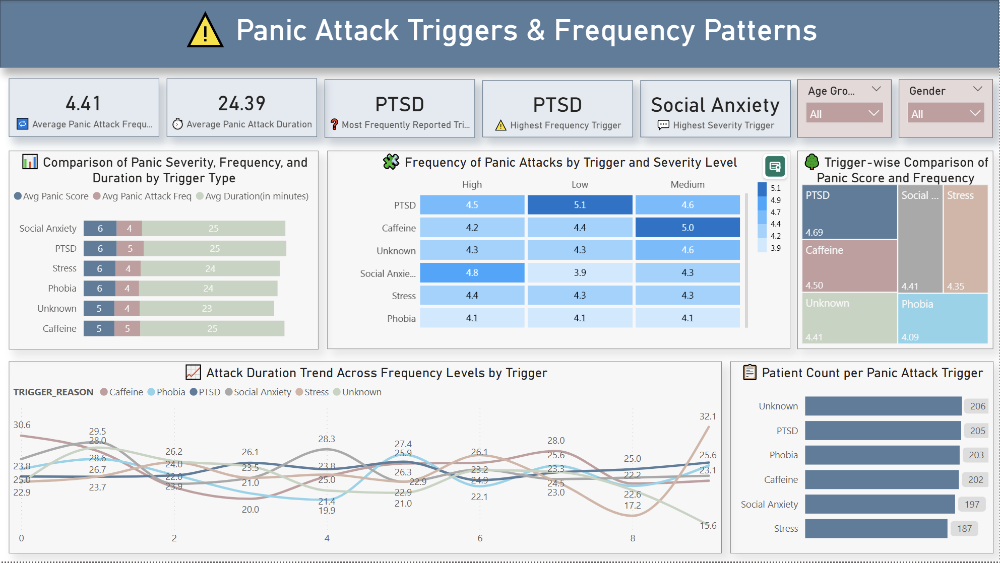

# 🧠 Panic Attack Analysis Dashboard (Power BI + Snowflake)

An interactive dashboard project to analyze panic attack patterns, symptoms, and influencing lifestyle factors using **Power BI** and **Snowflake**. This project helps uncover behavioral and clinical insights that can aid healthcare professionals and researchers in identifying key drivers of panic attacks.

---

## 📌 Project Overview

This project explores relationships between:
- Symptoms and patient demographics
- Lifestyle factors and panic severity
- Triggers and panic attack frequency/duration

The insights are derived from real patient data stored in **Snowflake** and visualized using a series of well-designed Power BI dashboards.

---

## 🛠️ Tools & Technologies Used

| Tool/Platform | Purpose |
|---------------|---------|
| **Power BI** | Dashboard creation, DAX measures, theme styling |
| **Snowflake** | Cloud-based data warehousing |
| **DAX** | Custom KPIs and calculated fields |
| **Power Query** | Data transformation, unpivoting symptoms |
| **Custom JSON Theme** | Clean, clinical and empathetic color palettes |

---

## 📊 Dashboards & Insights

### 🔹 1. **Symptoms Overview**


**Insights:**
- Out of 1200 patients, **Sweating** was the most frequently reported symptom.
- Over **58% of patients experience 3 or more symptoms**, highlighting high symptom co-occurrence.
- **Female and Male patients** show nearly equal distribution of symptoms, while **Non-binary patients** report symptoms at a lower rate.
- The **co-occurrence matrix** shows high overlap between **Shortness of Breath**, **Sweating**, and **Dizziness** — often experienced together.

---

### 🔹 2. **Lifestyle Impact on Panic Attacks**


**Insights:**
- Patients with **higher exercise frequency** tend to report slightly **lower panic scores and attack frequency**.
- **Sleep duration is inversely related** to panic severity — shorter sleep patterns are associated with higher scores.
- **Smokers and high caffeine consumers** show elevated panic scores, particularly when paired with low sleep.
- Over **50% of patients consume high caffeine**, and **27% are smokers** — both factors are correlated with worse panic outcomes.

---

### 🔹 3. **Triggers & Frequency Patterns**



**Insights:**
- **PTSD** is the most commonly reported trigger across patients.
- **Social Anxiety** leads to the **highest average panic severity**, despite not being the most common.
- Attack duration remains **fairly consistent (~25 minutes)** across different triggers.
- Patients with **stress or social anxiety triggers** tend to experience more severe attacks even if the frequency is moderate.
- The patient count is fairly distributed across known and unknown triggers, with **"Unknown" still forming the largest group**.

---

## 🧠 Key Learnings

- Integrated and queried data from **Snowflake** directly in Power BI using **Direct Query**.
- Built and applied **custom DAX measures** for clinical KPIs like panic severity, frequency trends, and behavioral segments.
- Created visually empathetic dashboards using **custom Power BI JSON themes**.
- Designed a **modular layout** to logically separate symptom, lifestyle, and trigger domains.
- Improved storytelling and decision-making capability in health data analytics.

---

## 💡 Skills Demonstrated

- Power BI Dashboard Design  
- DAX (Data Analysis Expressions)  
- Data Modeling and Normalization  
- Cloud Data Integration (Snowflake)  
- Analytical Thinking & Insight Extraction  
- Visual Data Storytelling for Mental Health  

---

## 📁 Folder Structure

```
📁 Panic_Attack_Dashboard/
├── Screenshots/
│   ├── Screenshot_1.png  # Symptoms Overview
│   ├── Screenshot_2.png  # Lifestyle Dashboard
│   └── Screenshot_3.png  # Triggers Dashboard
├── Themes/
│   ├── Panic_attack_dashboard_theme.json
├── README.md
└── Panic_Attack_Analysis_Dashboard.pbix
```

---

## 📬 Contact & Collaboration

Want to collaborate, give feedback, or hire me for BI/Data projects?  
📧 Email: dipeshyadav4444@gmail.com  
🔗 [LinkedIn](https://www.linkedin.com/in/dipesh-yadav-datascientist/)

---

> ⭐ **If you find this project useful, give it a star or fork it to build your own mental health analytics dashboard.**
